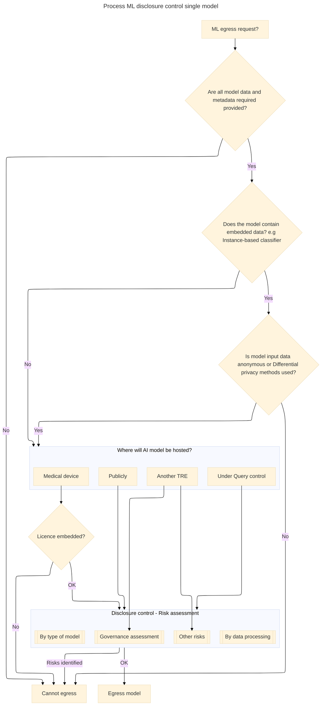

```mermaid
---
config:
  look: classic
  theme: base
  layout: elk
title: Process ML disclosure control single model
---

flowchart TB

 subgraph location["Where will AI model be hosted?"]
        l3["Medical device"]
        l2["Under Query control"]
        l4["Publicly"]
        l1["Another TRE"]
  end
 subgraph ra["Disclosure control - Risk assessment"]
        ra1[["By type of model"]]
        ra2[["By data processing"]]
        ra3[["Other risks"]]
        ra0[["Governance assessment"]]
  end
    e1["ML egress request?"] --> e2{"Are all model data and metadata required provided?"}
    e2 -- No --> noegress["Cannot egress"]
    e2 -- Yes --> e3{"Does the model contain embedded data? e.g Instance-based classifier"}
    e3 -- Yes --> e3.1{"Is model input data anonymous or Differential privacy methods used?"}
    e3.1 -- No --> noegress
    e3.1 -- Yes --> location
    e3 -- No --> location
    l2 --> ra
    l3 --> e7{"Licence embedded?"}
    e7 -- OK --> ra
    e7 -- No --> noegress
    l4 --> ra
    ra -- Risks identified --> noegress
    l1 --> ra0 & ra3
    ra -- OK --> e5["Egress model"]
    
```