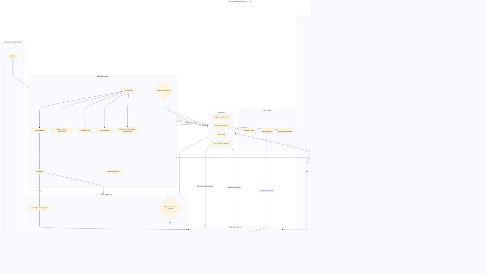

```mermaid
---
config:
  look: classic
  theme: base
  layout: elka
title: Process for ML projects in a TRE
---

flowchart TB

    subgraph design[Design ML Project]
        direction TB
        design1[Define project]
        design2[Define partners]
        design3[TRE Users]
        design4[Dataset access requirements]
        design5[IT requirements]
        design6[Project objectives]
        design7[ML/AI model life time cycle evaluation plan]
        design8[Project requirements]
        design9{ingress pre-trained ML?}
    end
    
    design1<-->design2
    design2<-->design3
    design1-->design4
    design1-->design5
    design1-->design6
    design1-->design7

    design<-->governance
        
    subgraph governance[Governance]
        direction LR
        governance0[Define project needs]
        governance1[Terms and conditions]
        governance2[ML licence]
        governance3[Non Discloser agreement]
    end
       
    subgraph data[Data access]
        direction TB
        data1[Feasibility study]
        data2[(Dataset gathering)]
        data3[(mock/synthetic dataset)]
    end

    design <--> data1
    design <--> |available upon request|data3

    subgraph location["Where will AI model be hosted?"]
        l3["Medical device"]
        l2["Under Query control"]
        l4["Publicly"]
        l1["Another TRE"]
    end
    
    design <--> location
    governance <--> location
    design9<-->governance
    
    subgraph ra[Risk assessment]
        direction TB
        ra1[Governance assessment]-->ra2{Within agreements?}
        ra2-->|No|ra3[Ingress not allowed]
        ra2-->|Yes|ra4[Model assessment]
        ra4-->ra5{IT risk assessment}
        ra5-->|Risks detected|ra3
        ra5-->|OK|ra6[Data assessment]
        ra6-->ra7{Can TRE host the external data?}
        ra7-->|No|ra3
        ra7-->|Yes|ra8[ML model risk assessment]
        ra8-->|Risks detected|ra3
    end

    design3-->training
    subgraph training[Training TRE users]
        direction TB
        training1{TRE user training completed}-->|NO|training2[No access to TRE]
        design3-->|Yes|training3[Access permission granted]
    end
    
    design<-->|TRE access request|governance
    governance-->training
    
    ra8-->|ML ingress|development

    training3-->development

    governance-->|ML model ingress allowed|development
    
    subgraph development[Project development]
        direction TB
        data2-->|Pseudo-anonymisation|data4[(Pseudo-anonymised dataset)]
        development1[External ML model]
        data4-->development2[data processing and analysis]
        development2-->development3[ML model]
        development2-->development4[Metadata]
        development2-->development5[Figures and tables]
    end
    
    development<-->|Project scope change|governance
    
    subgraph egress[ML egress request]
        direction LR
        subgraph da["Disclosure control - Risk assessment"]
            da1[["By type of model"]]
            da2[["By data processing"]]
            da3[["Other risks"]]
            da4[["Governance assessment"]]
        end
        egress1["ML egress request?"] --> egress2{"Are all model data and metadata required provided?"}
        egress2 -- No --> noegress["Cannot egress"]
        egress2 -- Yes --> egress3{"Does the model contain embedded data? e.g Instance-based classifier"}
        egress3 -- Yes --> egress3.1{"Is model input data anonymous or Differential privacy methods used?"}
        egress3.1 -- No --> noegress
        egress3.1 -- Yes --> location
        egress3 -- No --> location
        l2 --> da
        l3 --> egress7{"Licence embedded?"}
        egress7 -- OK --> da
        egress7 -- No --> noegress
        l4 --> da
        da -- Risks identified --> noegress
        l1 --> da4 & da3
        da -- OK --> egress5["Egress model"]
    end

    subgraph release[Deployment and monitoring]
        direction LR
        release1[deployment process]
        release2[re-define]
    end

    egress5-->release
    release2-->design

```
